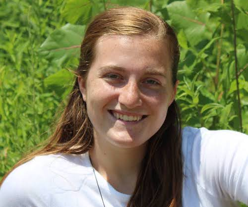

## About Me

I am currently pursuing an MA in General Linguistics at the University at Buffalo, with hopes to pursue a PhD in the near future. I am interested in Hispanic Linguistics, Language Preservation and Revitalization, Morphology, Semantics, and Variation. My capstone research is focused on semantic variation in Argentine Spanish, with hopes of exploring a novel branch of sociolinguistics. 

When I'm not researching, I spend my free time trying to keep all my plants alive (doing pretty well so far!), prepping for my ongoing Dungeons and Dragons campaign, or working on any of several ongoing arts & crafts projects I have going at any given time. 

||||
|:--|--|--:|
|[_Research_](research.md)|[_CV_](cv21.pdf)|[_Contact_](contact.md)|

### Research

My research goals are twofold; to further explore crosslinguistic and intralinguistic variation in the realms of semantics and morphology, and to examine and develop new tools for gathering semantic data in order to maintain ethical, informed, and broadly representative data collection in the field. I believe that the study of endangered languages will be particularly necessary to accomplish these goals, and will therefore play a leading role in the continuation of my research. My interests in the realm of semantics extend not only to the employ of psycholinguistic methods in investigating semantic processing but also to the use of empirical semantics in sociolinguistic analysis, a hitherto understudied domain. 
My research interests have primarily focused in Hispanic linguistics and language change, particularly in the areas of phonetics, semantics, and lexical change. Visit my [research page](research.md) to learn more. 

### CV

To see my full CV, click [here](cv21.pdf)!

### Contact

You can email me at: sjameson1107[at]gmail[dot]com

Follow me on Twitter @flockey15
